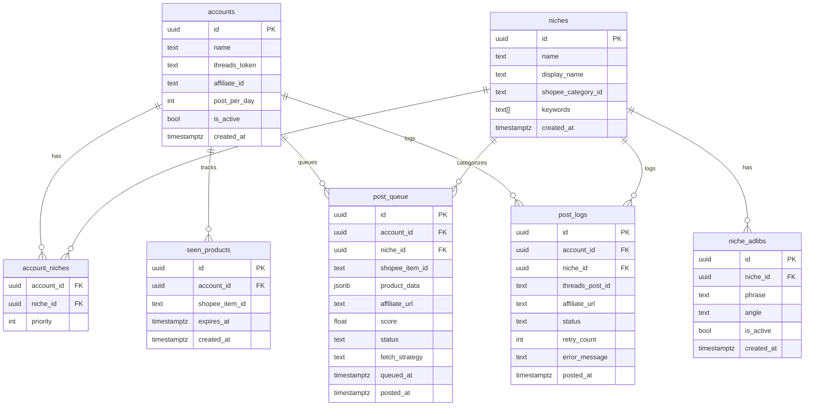

# ERD — racunjajan.online

7 tables total. All primary keys are UUID. All timestamps are `TIMESTAMPTZ`.

## Relationships summary
- `accounts` → `account_niches` (one-to-many)
- `niches` → `account_niches` (one-to-many) — junction table, many-to-many between accounts and niches
- `niches` → `niche_adlibs` (one-to-many)
- `accounts` → `seen_products` (one-to-many) — dedup is per-account
- `accounts` → `post_queue` (one-to-many)
- `niches` → `post_queue` (one-to-many)
- `accounts` → `post_logs` (one-to-many)
- `niches` → `post_logs` (one-to-many)

---

## Diagram



---

## Table notes

### accounts
Stores one row per Threads account. Phase 1 = 1 row.
`threads_token` and `affiliate_id` stored here (not env vars) to support multi-tenant.

### niches
Phase 1 seed data (4 niches):
| name | display_name | shopee_category_id |
|---|---|---|
| `rumah_tangga` | Barang Rumah Tangga | TBD — lookup from Shopee URL |
| `beauty` | Beauty & Skincare | TBD |
| `bayi_anak` | Perlengkapan Bayi & Anak | TBD |
| `makanan_minuman` | Makanan & Minuman | TBD |

### niche_adlibs
40 rows seeded on init (10 per niche). See PRD.md Section 3.3 for full seed data.
`angle` values: `benefit` | `pain_point` | `urgency` | `social_proof`
`is_active` = true by default. Toggle to false to disable a phrase without deleting.

### account_niches
Composite PK: `(account_id, niche_id)`.
`priority` = integer, ORDER BY ASC determines niche rotation order per account.
Phase 1 priority order: rumah_tangga=1, beauty=2, makanan_minuman=3, bayi_anak=4.

### seen_products
Dedup is **per-account** — same product can be posted by different accounts.
`expires_at` = `created_at + SEEN_EXPIRY_DAYS` (default 3 days).
After expiry, product is eligible to re-enter post_queue.

### post_queue
`status` values: `pending` | `posted` | `skipped` | `failed`
`fetch_strategy` values: `flash_sale` | `category` | `keyword` | `popular` | `expiry_override`
`product_data` JSONB shape:
```json
{
  "name": "string",
  "price": 150000,
  "original_price": 200000,
  "discount_pct": 25,
  "image_url": "https://...",
  "rating": 4.8,
  "sold_count": 1200,
  "description": "string",
  "shop_id": "string",
  "item_id": "string"
}
```

### post_logs
`status` values: `success` | `failed` | `retried`
`threads_post_id` = null if status is `failed`.
`retry_count` = 0 if first attempt succeeded.
Used by `daily_verification` job: `COUNT(*) WHERE DATE(posted_at) = TODAY AND status = 'success'`.
